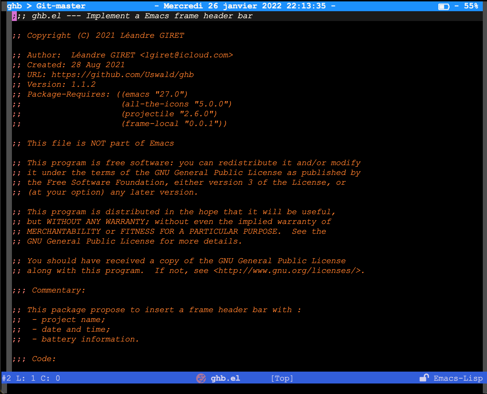

# Global Header Bar

<p align="center">
  <a href="https://github.com/Uswald/ghb/releases/latest"></a>
  <a href="https://github.com/domtronn/all-the-icons.el/blob/master/LICENSE"></a>
</p>



<p align="center">
<b><a href="#installation">Installation</a></b>
|
<b><a href="#usage">Usage</a></b>
</p>

## Overview

`ghb` is an utilities to display a top bar where to display some global information
like the date or the battery status.

Today it is not fully customizable, but in future this will be improve.

## Installation

`ghb` is not available in [MELPA](https://melpa.org/). Thus to install it you have to install all the dependencies manually. This dependencies are:
</br>
<a href="https://www.gnu.org/savannah-checkouts/gnu/emacs/emacs.html"></a>
</br>
<a href="https://github.com/domtronn/all-the-icons.el"></a>
</br>
<a href="https://github.com/bbatsov/projectile"></a>
</br>
<a href="https://github.com/sebastiencs/frame-local"></a>
</br>

Then clone the project where you want:

```bash
$ git clone https://github.com/Uswald/ghb
```

Finally add those lines in your emacs init file:

```el
(add-to-list 'load-path (expand-file-name "PATH-TO-GHB-DIRECTORY"))
(require 'ghb)
```

## Usage

`ghb` provides only two commands, one for open it and the other to close it.

| Command     | Note            |
|-------------|-----------------|
| `ghb-open`  | Open the `ghb`  |
| `ghb-close` | Close the `ghb` |

More over `ghb` provide some customs. This customs can be change with:

<kbd>M-x</kbd> `customize-group` <kbd>[RET]</kbd> `ghb` <kbd>[RET]</kdb>

| Custom                         | Default                        | Note                                                          |
|--------------------------------|--------------------------------|---------------------------------------------------------------|
| `ghb-battery-display-function` | `'ghb-battery-string-wo-icons` | Define if the battery status is display with or without icons |
| `ghb-battery-format`           | `%b%p%% (%L)`                  | Define the battery format (see `battery-format`)              |
| `ghb-time-format`              | `"- %A %d %B %Y - %X -"`       | Define the time format (see `format-time-string`)             |
| `ghb-time-idle-delay`          | `0.5`                          | Elapse time after last command to refresh `ghb`               |
| `ghb-time-update-interval`     | `0.5`                          | Elapse time between refresh while emacs idle                  |
